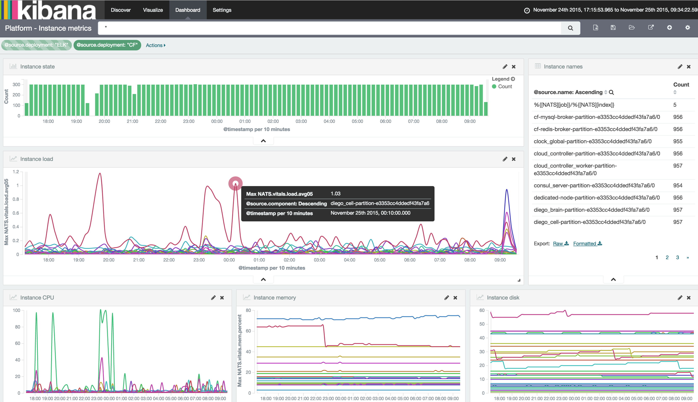
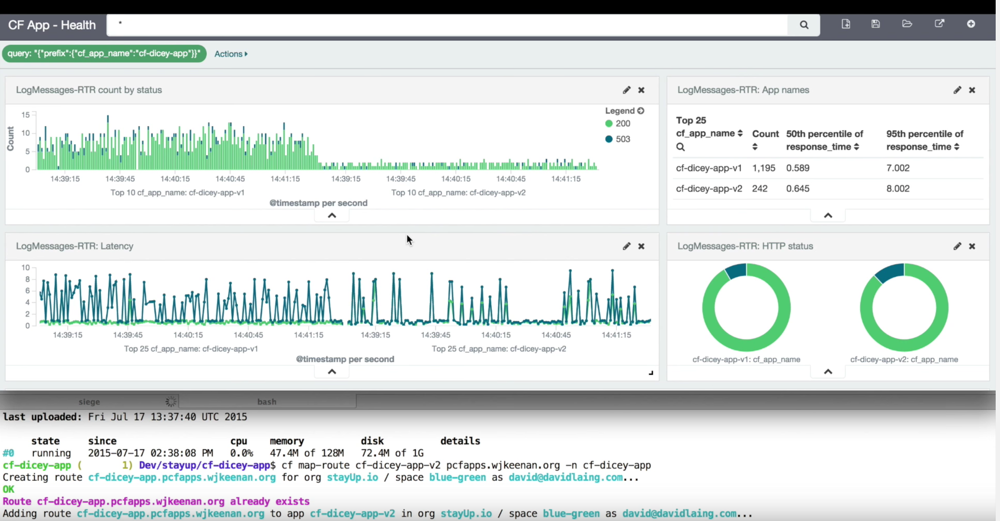
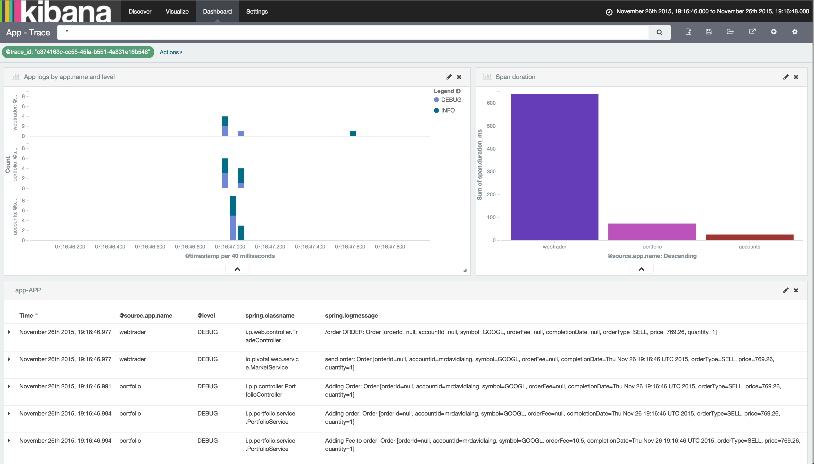

## [ CF + ELK <br /> Logging in the clouds ](#1)

```nohighlight
As a CF operator
I can extend my Cloud Foundry platform with log analysis
Using Logsearch for Cloudfoundry
```

<br><br>
<div align="middle">
<table width="90%">
<tr><td>

David Laing
<small>Product Owner, Logsearch</small>
</td>
<td>

Jack Wu (吴疆)
<small>Cloud Ops, Pivotal</small>
</td></tr>
</table>
</div>

---

### [ Microservices - must be this tall ](#2)

* Operating distributed systems is _hard_
	* Cloud Foundry platform
	* Microservices running on Cloud Foundry
* Centralised log and metric analysis lets you see what is going on
* Should be part of the platform

---

### [ Logsearch - adding ELK to CF platform ](#3)

* ELK stack deployed by BOSH
	* Running in production for 2 years
	* Log processing pipeline -> Log search engine -> Visualization tool
	* Linear scalability
* Logsearch for Cloud Foundry adds tight integration into CF ecosystem
  * Ingests all the logs ( and metrics )
  * Extracts and enriches
  * Zero configuration authentication and multitenant access control

---

## [ Log sources ](#4)

0. Platform component logs from syslog forwarders 
0. Platform metrics from CF Collector
0. Deployment data from BOSH NATs
0. App logs from Loggregator firehose

---


## [ Listen the Voice -- ELK for CloudFoundry ](#5)


* Log sources
	* Syslog of CloudFoundry components
	* AWS ELB access log
	* AWS RDS Log	 
* High Avaiability
	* Multi-AZ deployment 		
* Scalability
	* storage - extend storage when necessary 
	* computing - adding parser nodes when necessary 

---

## [ Multi-AZ ELK architecture ](#6)

<div align="middle">
	
</div>

---

## [ Multi-AZ ELK in Pivotal Webservice (PWS) ](#7)

* Deployment size
	* Totally 37 nodes among 3 Available Zones (AZ)
	* Totally 9 parser nodes (c3.large VM)
	* Totally 15 Elastic Search Nodes (r3.xlarge nodes)
	* Totally storage size - 18T
* Data size
	* 18 million lines log per hour
	* 27G indexed data per hour	

---

## [Listening PWS with ELK - 1 ](#8)

<div align="middle">
	
</div>

---

## [ Listening PWS with ELK - 2 ](#9)

<div align="middle">
	
</div>

---

## [ Listening PWS with ELK - 3 ](#10)

<div align="middle">
	
</div>

---

#### [ DEMO: BOSH Health Monitor Metrics ](#11)

<div align="middle">
	
</div>

---

#### [ DEMO: Enhanced Blue / Green deployment ](#12)

<div align="middle">
	
</div>

---

## [ ELK for PCF tile ](#13)

* Tile for Pivotal's Cloud Foundry distribution
* Adds
  * Support for Spring Cloud Microservices
  * Focus on security and audit logs
  * Commercial support

---

#### [ DEMO: Cross Microservice Transaction Tracing ](#13)

<div align="middle">
	
</div>

---

## [ Wrap-up ](#14)

* Log analysis enables operating distributed systems
* Logsearch for Cloud Foundry <br>&nbsp;&nbsp;-> logs analysis for CF platform
* ELK for PCF tile <br>&nbsp;&nbsp;-> commercial support with focus on Spring Cloud

<div align="middle">
	
</div>
