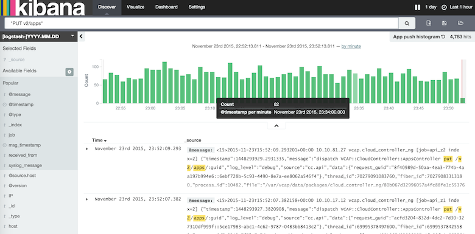

## [ CF + ELK <br /> Logging in the clouds ](#1)

```nohighlight
As a CF operator
I can extend my Cloud Foundry platform with log analysis
Using Logsearch for Cloudfoundry
```

---


## [ Microservices - must be this tall to play ](#2)

* Log and metric analysis required for continuous deployment


---

## [ History ](#3)

* Logsearch - an opensource project to deploy Elastic ELK stack with BOSH
  * sponsored for 2 years by City Index (thank you!)
* Logsearch for Cloud Foundry - an opensource Logsearch addon:
  * Extracts, parses and dashboards for CF App and Platform logs and metrics
  * Integrates with CF UAA to provide multi-tenant access control
* ELK for Pivotal Cloud Foundry - a commerical tile that adds:
  * Log parsing for Spring Cloud based microservices
  * Additional focus on security and audit logs
  * Support

---

## [ The Voice of CloudFoundry -- Loggrator ](#4)


---

## [ Listen the Voice -- ELK for CloudFoundry ](#5)

* Log sources
	* Syslog of CloudFoundry components
	* AWS ELB access log
	* AWS RDS Log	 
* High Avaiability
	* Multi-AZ deployment 		
* Scalability
	* storage - extend storage when necessary 
	* computing - adding parser nodes when necessary 
	
---

## [ Multi-AZ ELK architecture ](#6)


---

## [ Multi-AZ ELK in Pivotal Webservice (PWS) ](#7)

* Deployment size
	* Totally 37 nodes among 3 Available Zones (AZ)
	* Totally 9 parser nodes (c3.large VM)
	* Totally 15 Elastic Search Nodes (r3.xlarge nodes)
	* Totally storage size - 18T
* Data size
	* 18 million lines log per hour
	* 27G indexed data per hour	
	
---

## [Listening PWS with ELK - 1 ](#8)


---
	 
## [ Listening PWS with ELK - 2 ](#9)



---

## [ Listening PWS with ELK - 3 ](#10)


---


## [ BOSH Health Monitor Metrics ](#11)

* Demo of BOSH Health Monitor metrics

---

## [ Blue / Green deployment ](#12)

* Demo of dicey-app blue/green deployment

---

## [ Cross Microservice Transaction Tracing ](#13)

* Demo of cf-SpringBootTrader cross microservice log analysis
